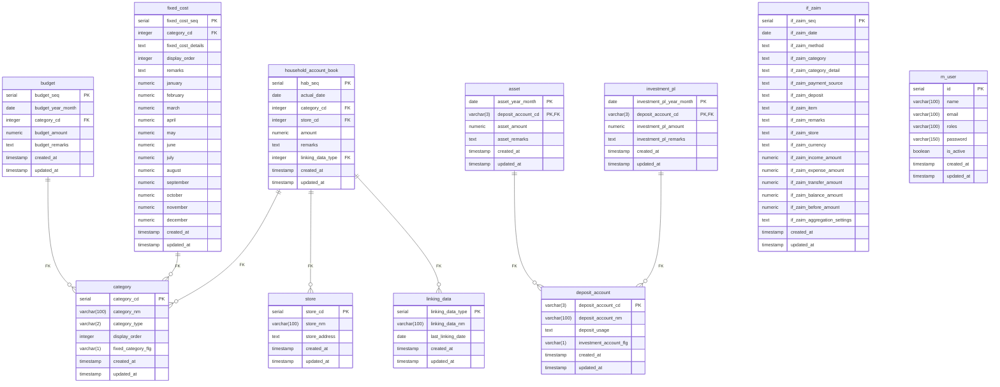

# データベース設計書

## 1. 概要

このドキュメントは、家計簿Webアプリケーション「recsav-api」のデータベース設計について記述します。

## 2. ER図

## 3. テーブル定義

### 3.1. if_zaim (Zaimインターフェース)

| カラム名 | データ型 | 主キー | 説明 |
| :--- | :--- | :--- | :--- |
| if_zaim_seq | serial | PK | ZaimインターフェースSeq |
| if_zaim_date | date | | 日付 |
| if_zaim_method | text | | 方法 |
| if_zaim_category | text | | カテゴリ |
| if_zaim_category_detail | text | | カテゴリの内訳 |
| if_zaim_payment_source | text | | 支払元 |
| if_zaim_deposit | text | | 入金先 |
| if_zaim_item | text | | 品目 |
| if_zaim_remarks | text | | メモ |
| if_zaim_store | text | | お店 |
| if_zaim_currency | text | | 通貨 |
| if_zaim_income_amount | numeric(8, 0) | | 収入 |
| if_zaim_expense_amount | numeric(8, 0) | | 支出 |
| if_zaim_transfer_amount | numeric(8, 0) | | 振替 |
| if_zaim_balance_amount | numeric(8, 0) | | 残高調整 |
| if_zaim_before_amount | numeric(8, 0) | | 通貨変換前の金額 |
| if_zaim_aggregation_settings | text | | 集計の設定 |
| created_at | timestamp | | 登録日時 |
| updated_at | timestamp | | 更新日時 |

### 3.2. category (カテゴリ)

| カラム名 | データ型 | 主キー | 説明 |
| :--- | :--- | :--- | :--- |
| category_cd | serial | PK | カテゴリコード |
| category_nm | varchar(100) | | カテゴリ名 |
| category_type | varchar(2) | | カテゴリ種別（1：収入、2：支出） |
| display_order | integer | | 表示順 |
| fixed_category_flg | varchar(1) | | 固定費カテゴリーフラグ |
| created_at | timestamp | | 登録日時 |
| updated_at | timestamp | | 更新日時 |

### 3.3. store (店)

| カラム名 | データ型 | 主キー | 説明 |
| :--- | :--- | :--- | :--- |
| store_cd | serial | PK | 店コード |
| store_nm | varchar(100) | | 店名 |
| store_address | text | | 店住所 |
| created_at | timestamp | | 登録日時 |
| updated_at | timestamp | | 更新日時 |

### 3.4. deposit_account (預金口座)

| カラム名 | データ型 | 主キー | 説明 |
| :--- | :--- | :--- | :--- |
| deposit_account_cd | varchar(3) | PK | 預金口座コード |
| deposit_account_nm | varchar(100) | | 預金口座名 |
| deposit_usage | text | | 預金用途 |
| investment_account_flg | varchar(1) | | 投資口座フラグ |
| created_at | timestamp | | 登録日時 |
| updated_at | timestamp | | 更新日時 |

### 3.5. linking_data (連携データ)

| カラム名 | データ型 | 主キー | 説明 |
| :--- | :--- | :--- | :--- |
| linking_data_type | serial | PK | 連携データタイプ |
| linking_data_nm | varchar(100) | | 連携データ名 |
| last_linking_date | date | | 最終連携日 |
| created_at | timestamp | | 登録日時 |
| updated_at | timestamp | | 更新日時 |

### 3.6. household_account_book (家計簿)

| カラム名 | データ型 | 主キー | 外部キー | 説明 |
| :--- | :--- | :--- | :--- | :--- |
| hab_seq | serial | PK | | 家計簿Seq |
| actual_date | date | | | 実績日 |
| category_cd | integer | | category(category_cd) | カテゴリコード |
| store_cd | integer | | store(store_cd) | 店コード |
| amount | numeric(8, 0) | | | 金額 |
| remarks | text | | | 備考 |
| linking_data_type | integer | | linking_data(linking_data_type) | 連携データタイプ |
| created_at | timestamp | | | 登録日時 |
| updated_at | timestamp | | | 更新日時 |

### 3.7. budget (予算)

| カラム名 | データ型 | 主キー | 外部キー | 説明 |
| :--- | :--- | :--- | :--- | :--- |
| budget_seq | serial | PK | | 予算Seq |
| budget_year_month | date | | | 予算年月 |
| category_cd | integer | | category(category_cd) | カテゴリコード |
| budget_amount | numeric(8, 0) | | | 予算金額 |
| budget_remarks | text | | | 予算備考 |
| created_at | timestamp | | | 登録日時 |
| updated_at | timestamp | | | 更新日時 |

### 3.8. asset (資産)

| カラム名 | データ型 | 主キー | 外部キー | 説明 |
| :--- | :--- | :--- | :--- | :--- |
| asset_year_month | date | PK | | 資産年月 |
| deposit_account_cd | varchar(3) | PK | deposit_account(deposit_account_cd) | 預金口座コード |
| asset_amount | numeric(8, 0) | | | 資産金額 |
| asset_remarks | text | | | 資産備考 |
| created_at | timestamp | | | 登録日時 |
| updated_at | timestamp | | | 更新日時 |

### 3.9. investment_pl (投資損益)

| カラム名 | データ型 | 主キー | 外部キー | 説明 |
| :--- | :--- | :--- | :--- | :--- |
| investment_pl_year_month | date | PK | | 投資損益年月 |
| deposit_account_cd | varchar(3) | PK | deposit_account(deposit_account_cd) | 預金口座コード |
| investment_pl_amount | numeric(8, 0) | | | 投資損益金額 |
| investment_pl_remarks | text | | | 投資損益備考 |
| created_at | timestamp | | | 登録日時 |
| updated_at | timestamp | | | 更新日時 |

### 3.10. fixed_cost (固定費)

| カラム名 | データ型 | 主キー | 外部キー | 説明 |
| :--- | :--- | :--- | :--- | :--- |
| fixed_cost_seq | serial | PK | | 固定費SEQ |
| category_cd | integer | | category(category_cd) | カテゴリコード |
| fixed_cost_details | text | | | 固定費内訳 |
| display_order | integer | | | 表示順 |
| remarks | text | | | 備考 |
| january | numeric(8, 0) | | | 1月 |
| february | numeric(8, 0) | | | 2月 |
| march | numeric(8, 0) | | | 3月 |
| april | numeric(8, 0) | | | 4月 |
| may | numeric(8, 0) | | | 5月 |
| june | numeric(8, 0) | | | 6月 |
| july | numeric(8, 0) | | | 7月 |
| august | numeric(8, 0) | | | 8月 |
| september | numeric(8, 0) | | | 9月 |
| october | numeric(8, 0) | | | 10月 |
| november | numeric(8, 0) | | | 11月 |
| december | numeric(8, 0) | | | 12月 |
| created_at | timestamp | | | 登録日時 |
| updated_at | timestamp | | | 更新日時 |

### 3.11. m_user (ユーザマスタ)

| カラム名 | データ型 | 主キー | 説明 |
| :--- | :--- | :--- | :--- |
| id | serial | PK | ユーザID |
| name | varchar(100) | | ユーザ名 |
| email | varchar(100) | | e-mail |
| roles | varchar(100) | | ロール |
| password | varchar(150) | | パスワード |
| is_active | boolean | | 有効 |
| created_at | timestamp | | 登録日時 |
| updated_at | timestamp | | 更新日時 |

## 4. ビュー定義

### 4.1. v_household_account_book (家計簿ビュー)
家計簿テーブルにカテゴリ名や店名などを結合し、表示用に加工したビュー。

| カラム名 | 説明 |
| :--- | :--- |
| hab_seq | 家計簿Seq |
| year | 年 |
| actual_date | 実績日 |
| category_type | カテゴリ種別（1：収入、2：支出） |
| display_category_type_nm | 表示用カテゴリ種別名（1：収入、2：支出（固定費）、3：支出（変動費）） |
| category_cd | カテゴリコード |
| category_nm | カテゴリ名 |
| display_category_nm | 表示用カテゴリ名 |
| display_income_category_nm | 表示用カテゴリ名（収入） |
| store_cd | 店コード |
| store_nm | 店名 |
| amount | 金額 |
| display_amount | 表示用金額（支出は負数） |
| remarks | 備考 |
| linking_data_type | 連携データタイプ |

### 4.2. v_asset (資産ビュー)
資産テーブルに預金口座名を結合し、表示用に加工したビュー。

| カラム名 | 説明 |
| :--- | :--- |
| year | 年 |
| asset_year_month | 資産年月 |
| deposit_account_type | 預金口座種別（0：生活費・貯金口座、1：投資口座） |
| display_deposit_account_type_nm | 表示用預金口座種別名（0：生活費・貯金口座、1：投資口座） |
| deposit_account_cd | 預金口座コード |
| deposit_account_nm | 預金口座名 |
| display_deposit_account_nm | 表示用預金口座名 |
| asset_amount | 資産金額 |
| asset_remarks | 資産備考 |

### 4.3. v_investment_pl (投資損益ビュー)
投資損益テーブルに預金口座名を結合し、表示用に加工したビュー。

| カラム名 | 説明 |
| :--- | :--- |
| year | 年 |
| investment_pl_year_month | 投資損益年月 |
| deposit_account_type | 預金口座種別（0：生活費・貯金口座、1：投資口座） |
| display_deposit_account_type_nm | 表示用預金口座種別名（0：生活費・貯金口座、1：投資口座） |
| deposit_account_cd | 預金口座コード |
| deposit_account_nm | 預金口座名 |
| display_deposit_account_nm | 表示用預金口座名 |
| investment_pl_amount | 投資損益金額 |
| investment_pl_remarks | 投資損益備考 |

### 4.4. v_fixed_cost (固定費ビュー)
固定費テーブルを月ごとに縦持ちに変換し、表示用に加工したビュー。

| カラム名 | 説明 |
| :--- | :--- |
| display_category_nm | カテゴリ名 |
| fixed_cost_details | 固定費内訳 |
| remarks | 備考 |
| month | 月 |
| fixed_cost_amount | 固定費金額 |

### 4.5. v_month_calen (年月カレンダービュー)
指定した期間の年月を生成するビュー。

| カラム名 | 説明 |
| :--- | :--- |
| ym | 年月 |
