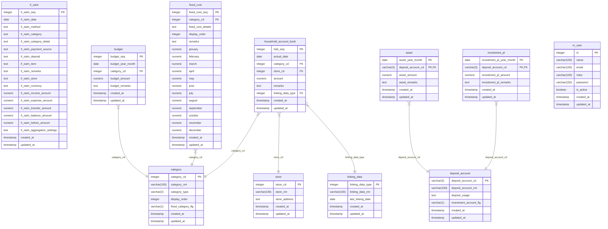

# データベース設計書

## ER図

## テーブル定義

### if_zaim (Zaimインターフェース)

| 列名 | データ型 | 説明 |
| --- | --- | --- |
| if_zaim_seq | serial | ZaimインターフェースSeq (PK) |
| if_zaim_date | date | 日付 |
| if_zaim_method | text | 方法 |
| if_zaim_category | text | カテゴリ |
| if_zaim_category_detail | text | カテゴリの内訳 |
| if_zaim_payment_source | text | 支払元 |
| if_zaim_deposit | text | 入金先 |
| if_zaim_item | text | 品目 |
| if_zaim_remarks | text | メモ |
| if_zaim_store | text | お店 |
| if_zaim_currency | text | 通貨 |
| if_zaim_income_amount | numeric(8, 0) | 収入 |
| if_zaim_expense_amount | numeric(8, 0) | 支出 |
| if_zaim_transfer_amount | numeric(8, 0) | 振替 |
| if_zaim_balance_amount | numeric(8, 0) | 残高調整 |
| if_zaim_before_amount | numeric(8, 0) | 通貨変換前の金額 |
| if_zaim_aggregation_settings | text | 集計の設定 |
| created_at | timestamp | 登録日時 |
| updated_at | timestamp | 更新日時 |

### category (カテゴリ)

| 列名 | データ型 | 説明 |
| --- | --- | --- |
| category_cd | serial | カテゴリコード (PK) |
| category_nm | varchar(100) | カテゴリ名 |
| category_type | varchar(2) | カテゴリ種別（1：収入、2：支出） |
| display_order | integer | 表示順 |
| fixed_category_flg | varchar(1) | 固定費カテゴリーフラグ |
| created_at | timestamp | 登録日時 |
| updated_at | timestamp | 更新日時 |

### store (店)

| 列名 | データ型 | 説明 |
| --- | --- | --- |
| store_cd | serial | 店コード (PK) |
| store_nm | varchar(100) | 店名 |
| store_address | text | 店住所 |
| created_at | timestamp | 登録日時 |
| updated_at | timestamp | 更新日時 |

### deposit_account (預金口座)

| 列名 | データ型 | 説明 |
| --- | --- | --- |
| deposit_account_cd | varchar(3) | 預金口座コード (PK) |
| deposit_account_nm | varchar(100) | 預金口座名 |
| deposit_usage | text | 預金用途 |
| investment_account_flg | varchar(1) | 投資口座フラグ |
| created_at | timestamp | 登録日時 |
| updated_at | timestamp | 更新日時 |

### linking_data (連携データ)

| 列名 | データ型 | 説明 |
| --- | --- | --- |
| linking_data_type | serial | 連携データタイプ (PK) |
| linking_data_nm | varchar(100) | 連携データ名 |
| last_linking_date | date | 最終連携日 |
| created_at | timestamp | 登録日時 |
| updated_at | timestamp | 更新日時 |

### household_account_book (家計簿)

| 列名 | データ型 | 説明 |
| --- | --- | --- |
| hab_seq | serial | 家計簿Seq (PK) |
| actual_date | date | 実績日 |
| category_cd | integer | カテゴリコード (FK) |
| store_cd | integer | 店コード (FK) |
| amount | numeric(8, 0) | 金額 |
| remarks | text | 備考 |
| linking_data_type | integer | 連携データタイプ (FK) |
| created_at | timestamp | 登録日時 |
| updated_at | timestamp | 更新日時 |

### budget (予算)

| 列名 | データ型 | 説明 |
| --- | --- | --- |
| budget_seq | serial | 予算Seq (PK) |
| budget_year_month | date | 予算年月 |
| category_cd | integer | カテゴリコード (FK) |
| budget_amount | numeric(8, 0) | 予算金額 |
| budget_remarks | text | 予算備考 |
| created_at | timestamp | 登録日時 |
| updated_at | timestamp | 更新日時 |

### asset (資産)

| 列名 | データ型 | 説明 |
| --- | --- | --- |
| asset_year_month | date | 資産年月 (PK) |
| deposit_account_cd | varchar(3) | 預金口座コード (PK, FK) |
| asset_amount | numeric(8, 0) | 資産金額 |
| asset_remarks | text | 資産備考 |
| created_at | timestamp | 登録日時 |
| updated_at | timestamp | 更新日時 |

### investment_pl (投資損益)

| 列名 | データ型 | 説明 |
| --- | --- | --- |
| investment_pl_year_month | date | 投資損益年月 (PK) |
| deposit_account_cd | varchar(3) | 預金口座コード (PK, FK) |
| investment_pl_amount | numeric(8, 0) | 投資損益金額 |
| investment_pl_remarks | text | 投資損益備考 |
| created_at | timestamp | 登録日時 |
| updated_at | timestamp | 更新日時 |

### fixed_cost (固定費)

| 列名 | データ型 | 説明 |
| --- | --- | --- |
| fixed_cost_seq | serial | 固定費SEQ (PK) |
| category_cd | integer | カテゴリコード (FK) |
| fixed_cost_details | text | 固定費内訳 |
| display_order | integer | 表示順 |
| remarks | text | 備考 |
| january | numeric(8, 0) | 1月 |
| february | numeric(8, 0) | 2月 |
| march | numeric(8, 0) | 3月 |
| april | numeric(8, 0) | 4月 |
| may | numeric(8, 0) | 5月 |
| june | numeric(8, 0) | 6月 |
| july | numeric(8, 0) | 7月 |
| august | numeric(8, 0) | 8月 |
| september | numeric(8, 0) | 9月 |
| october | numeric(8, 0) | 10月 |
| november | numeric(8, 0) | 11月 |
| december | numeric(8, 0) | 12月 |
| created_at | timestamp | 登録日時 |
| updated_at | timestamp | 更新日時 |

### m_user (ユーザマスタ)

| 列名 | データ型 | 説明 |
| --- | --- | --- |
| id | serial | ID (PK) |
| name | varchar(100) | ユーザ名 |
| email | varchar(100) | e-mail |
| roles | varchar(100) | ロール |
| password | varchar(150) | パスワード |
| is_active | boolean | 有効 |
| created_at | timestamp | 登録日時 |
| updated_at | timestamp | 更新日時 |

## ビュー定義

### v_household_account_book (家計簿ビュー)

| 列名 | データ型 | 説明 |
| --- | --- | --- |
| hab_seq | integer | 家計簿Seq |
| year | varchar | 年 |
| actual_date | date | 実績日 |
| category_type | varchar(2) | カテゴリ種別（1：収入、2：支出） |
| display_category_type_nm | text | 表示用カテゴリ種別名（1：収入、2：支出（固定費）、3：支出（変動費）） |
| category_cd | integer | カテゴリコード |
| category_nm | varchar(100) | カテゴリ名 |
| display_category_nm | text | 表示用カテゴリ名 |
| display_income_category_nm | text | 表示用カテゴリ名（収入） |
| store_cd | integer | 店コード |
| store_nm | varchar(100) | 店名 |
| amount | numeric(8, 0) | 金額 |
| display_amount | numeric | 表示用金額（支出は負数） |
| remarks | text | 備考 |
| linking_data_type | integer | 連携データタイプ |

### v_asset (資産ビュー)

| 列名 | データ型 | 説明 |
| --- | --- | --- |
| year | varchar | 年 |
| asset_year_month | date | 資産年月 |
| deposit_account_type | varchar(1) | 預金口座種別（0：生活費・貯金口座、1：投資口座） |
| display_deposit_account_type_nm | text | 表示用預金口座種別名（0：生活費・貯金口座、1：投資口座） |
| deposit_account_cd | varchar(3) | 預金口座コード |
| deposit_account_nm | varchar(100) | 預金口座名 |
| display_deposit_account_nm | text | 表示用預金口座名 |
| asset_amount | numeric(8, 0) | 資産金額 |
| asset_remarks | text | 資産備考 |

### v_investment_pl (投資損益ビュー)

| 列名 | データ型 | 説明 |
| --- | --- | --- |
| year | varchar | 年 |
| investment_pl_year_month | date | 投資損益年月 |
| deposit_account_type | varchar(1) | 預金口座種別（0：生活費・貯金口座、1：投資口座） |
| display_deposit_account_type_nm | text | 表示用預金口座種別名（0：生活費・貯金口座、1：投資口座） |
| deposit_account_cd | varchar(3) | 預金口座コード |
| deposit_account_nm | varchar(100) | 預金口座名 |
| display_deposit_account_nm | text | 表示用預金口座名 |
| investment_pl_amount | numeric(8, 0) | 投資損益金額 |
| investment_pl_remarks | text | 投資損益備考 |

### v_fixed_cost (固定費ビュー)

| 列名 | データ型 | 説明 |
| --- | --- | --- |
| display_category_nm | text | カテゴリ名 |
| fixed_cost_details | text | 固定費内訳 |
| remarks | text | 備考 |
| month | text | 月 |
| fixed_cost_amount | numeric | 固定費金額 |

### v_month_calen (年月カレンダービュー)

| 列名 | データ型 | 説明 |
| --- | --- | --- |
| ym | text | 年月 |